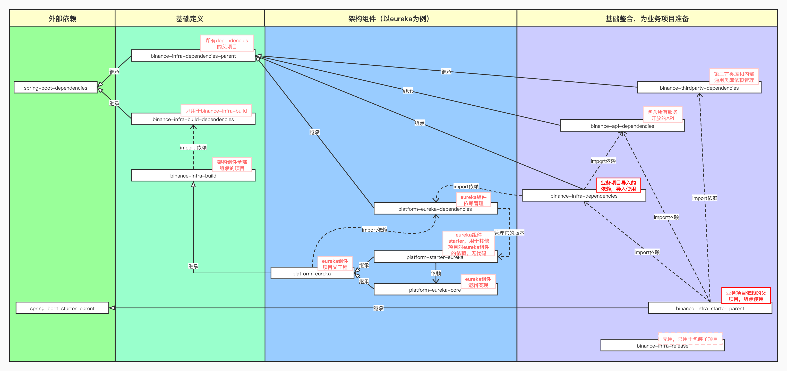

# 基础架构包使用简单说明

各基础架构包的手册，访问：https://confluence.toolsfdg.net/pages/viewpage.action?pageId=38191316

## 架构包使用方式

支持两种方式，**导入依赖**或者**继承父工程**。

### 导入依赖

```xml
	<dependencyManagement>
		<dependencies>
			<dependency>
				<groupId>com.binance.infra.avengers</groupId>
				<artifactId>binance-infra-dependencies</artifactId>
				<version>2.0.1-SNAPSHOT</version>
				<type>pom</type>
				<scope>import</scope>
			</dependency>
		</dependencies>
	</dependencyManagement>
```

### 继承父工程

```xml
    <parent>
        <groupId>com.binance.infra.avengers</groupId>
        <artifactId>binance-infra-starter-parent</artifactId>
        <version>2.0.1-SNAPSHOT</version>
        <relativePath />
    </parent>
```

## Eureka

https://confluence.toolsfdg.net/pages/viewpage.action?pageId=23729614

### DEV地址

```properties
eureka.client.serviceUrl.defaultZone=http://internal-dev-eureka1-inside-1336840952.ap-northeast-1.elb.amazonaws.com:8761/eureka/,http://internal-dev-eureka2-inside-1696914923.ap-northeast-1.elb.amazonaws.com:8761/eureka
```

### 定义灰度标签

* 服务端

  `-Dspring.application.envflag=gray-label`

* 请求时

  添加请求头：`X-GRAY-ENV=gray-label`

## Apollo环境

https://confluence.toolsfdg.net/pages/viewpage.action?pageId=23728483

***本地启动，无需任何配置，自动连接dev环境的Apollo， appId为springboot服务名。***

apollo配置环境的确定规则为（以下规则均不区分大小写）：

1. 指定了spring.profiles.active属性，如果以dev或local结尾，则环境为dev；如果以qa结尾，则环境为qa；否则，就取配置的值。
2. 指定了系统属性env，如果以dev或者local结尾，则环境为dev；如果以qa结尾，则环境为qa；否则，就取配置的值。
3. 以上两者都没有配置，则环境为dev。

> 由platform-apollo-core中的com.binance.platform.apollo.ApolloApplicationRunListener#initEnvAndMeta中自动设置。
>
> apollo meta url清单位于src/main/resources/apollo-env.properties

## 日志

系统中无需做任何配置，默认包含了`Kafka`和`Console`（***在生产环境只打印FATAL以上的日志***）2个`Appendor`。

如果要过滤掉某些日志可以在类路径下，添加如下格式的`log4j2.xml`：

```xml
<?xml version="1.0" encoding="UTF-8"?>
<Configuration>
    <Appenders>
        <Console name="Console" target="SYSTEM_OUT">
            <PatternLayout pattern="%d{HH:mm:ss.SSS} [%t] %-5level %logger{36} - %msg%n"/>
        </Console>
    </Appenders>
    <Loggers>
        <!-- 过滤掉org.springframework.boot.actuate.endpoint.we及其子对象的日志 -->
        <Logger name="org.springframework.boot.actuate.endpoint.we" level="error"/>
        <Root level="info">
            <AppenderRef ref="Console"/>
        </Root>
    </Loggers>
</Configuration>
```

> 注意：这里pattern是不生效的，默认的pattern为：
>
> `[%-p] [%d{yyyy.MM.dd HH:mm:ss.SSS}] [${sys:local-ip}] [%X{traceId}] [%t] [%c(%L)] - %m%n`

## 错误码及错误提示

https://confluence.toolsfdg.net/pages/viewpage.action?pageId=8296277

1. 定义枚举，继承com.binance.master.error.ErrorCode
2. 自定义应用自己的error code
3. 在类路径下定义i18n/messages为基本名称message bundle文件，key为每个枚举值的全限定名
4. 使用com.binance.master.web.handlers.MessageHelper就可以获取该code对应的描述
5. 另外，中台也有功能根据code和客户语言类型，对错误描述做转换

# binance-infra项目结构

## binance-infra-1.0

spring-boot 1.x版本，已停止维护。

## binance-infra-2.0

https://confluence.toolsfdg.net/pages/viewpage.action?pageId=38191316

spring-boot 2.x版本。

辅助项目，本身没有任何代码和依赖管理，只是在install phase和deploy phase中增加了一个exec-maven-plugin的任务，启动根目录下的deploy-all.sh，将文件夹下的其他项目发布到maven仓库中。此项目与目录下其他项目间没有父子关系。

### binance-infra

顶级项目，模块组件父项目，下面包含了所有的模块组件项目，用于不同的架构目的。



#### binance-infra-common

框架各组件通用性的代码，用于完成全局性预置逻辑，实现整体微服务体系的串联。

##### platform-common-dependencies

定义组件的依赖，父pom是binance-infra-dependencies-parent。它定义的依赖被binance-infra-common导入，然后传递给platform-common-core。

##### platform-common-core

定义组件的代码，父pom是binance-infra-common。


#### Platform-eureka （目录binance-infra-eureka）

***常规架构组件项目，拥有一致的pom结构。***

Eureka模块主项目。父项目为binance-infra-build。导入了platform-eureka-dependencies的依赖。platform-eureka-core，platform-starter-eureka这2个项目的父项目。

##### platform-eureka-dependencies

定义依赖，父项目为binance-infra-dependencies-parent。

##### platform-eureka-core

定义代码，父pom是platform-eureka，定制化配置、灰度等。

##### platform-starter-eureka

启动器项目，**用于被业务项目依赖**，对platform-eureka-core的简单包装，父pom是platform-amazons3。


### binance-infra-build

顶级项目，依赖集中管理。其dependencyManagement元素中导入了其子模块binance-infra-build-dependencies的内容。其与其子模块间没有父子关系。

项目中定义了通用性的依赖管理和插件管理。

#### binance-infra-build-dependencies

binance-infra-build项目的依赖管理，父项目为spring-boot-dependencies。

#### binance-infra-dependencies-parent

其他架构模块中dependencies项目的父项目。父项目为spring-boot-dependencies。


### binance-infra-release

binance-infra-build的子项目，只是一个辅助项目，跟目录下的其他项目没有父子关系。

#### binance-api-dependencies

所有内部api的依赖管理。父项目是binance-infra-dependencies-parent。

#### binance-infra-dependencies

所有业务项目需要导入的依赖管理，也包括binance-api-dependencies，binance-thirdparty-dependencies，用于导入业务项目中。父项目是binance-infra-dependencies-parent。

#### binance-infra-starter-parent

starter项目的父项目，导入了binance-api-dependencies，binance-infra-dependencies和binance-thirdparty-dependencies。父项目为spring-boot-starter-parent。

***这个项目用于业务项目继承，引入集中管理的全部依赖配置。***

#### binance-thirdparty-dependencies

第三方类库和内部通用类库依赖管理项目。父项目是binance-infra-dependencies-parent。


### binance-infra-sample

顶级项目，业务项目开发样例。导入了binance-infra-dependencies管理的依赖。

是目录下所有二级目录对应项目的父项目。

#### binance-infra-sample-api

API定义项目，依赖platform-starter-openfeign。

父项目为binance-infra-sample。

#### binance-infra-sample-consumer

服务调用者项目，依赖binance-infra-sample-api及其它自身需要的依赖。

#### binance-infra-sample-provider

服务提供者项目，依赖binance-infra-sample-api及其它自身需要的依赖。

#### binance-infra-sample-rabbit

platform-starter-rabbit使用样例。
