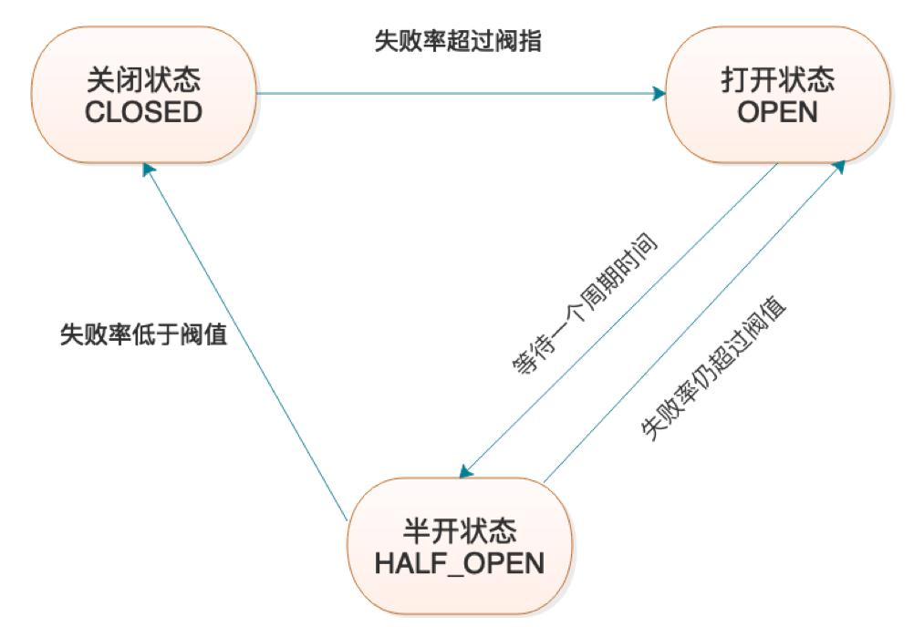
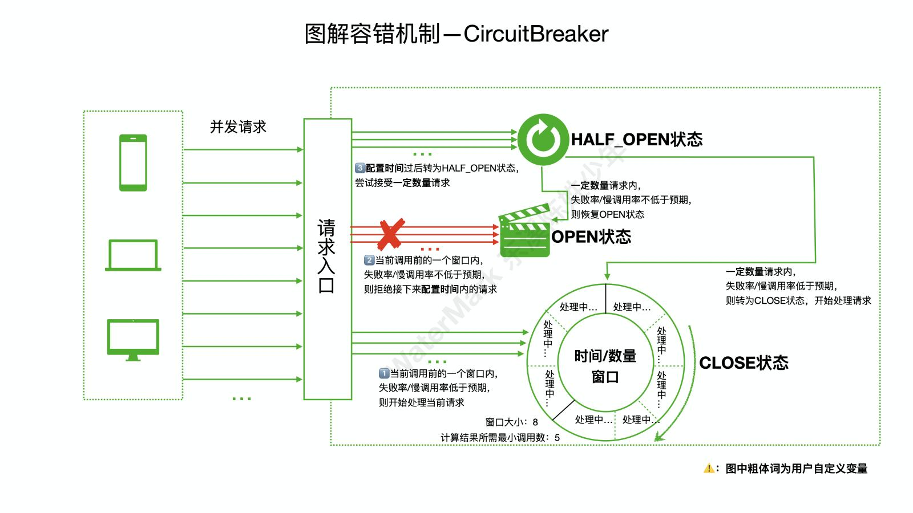
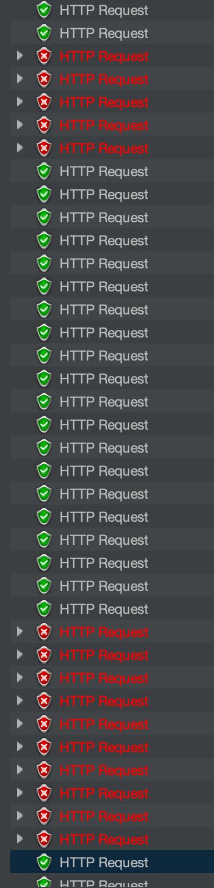

# 本文档演示客户端和服务端如何实现限流及熔断

使用限流熔断需依赖如下：

```xml
        <dependency>
            <groupId>com.binance.infra.avengers</groupId>
            <artifactId>platform-starter-resilience4j</artifactId>
        </dependency>
```

## 限流

### 服务端限流

如需集群限流，需额外增加redis：
```xml
        <dependency>
            <groupId>com.binance.infra.avengers</groupId>
            <artifactId>platform-starter-redis</artifactId>
        </dependency>
```

代码实例：
```java
    @GetMapping("all")
    @ServerRateLimiter(strategy = IpRateLimiterStrategy.class,
            limitForPeriod = "${find.books.rateLimit:1}",
            limitRefreshPeriod = "1", useRedis = false)
    public Response<Collection<Book>> findAll(){
        log.info("searching all books...");
        return Response.success(BOOK_STORE.values());
    }
```

 注意点：
 - 如果采用自定义的strategy，Spring容器中必须存在一个该策略的一个bean，可采用@Component或@Bean皆可
 - limitForPeriod和limitRefreshPeriod两个参数支持apollo配置，key中必须含有ratelimit，否则无法动态更新
 - 采用限流和不限流对比，对qps影响大约在10%所有，开发本机测试结果，可能存在误差
 - useRedis=true表示集群限流，因不断与redis同步数据，理论上一定有影响，建议小流量限流时使用，如10个实例，但是集群限流数为8个
 - useRedis=false表示单机限流，limitForPeriod的值为本机在刷新时间片段内的可接受流量，多实例时，总流量需乘以实例数
 - 目前不支持根据渠道有区别的限流，如针对同一个接口对渠道A限流100，对渠道B限流200

### 客户端限流

### 被限流后的response

http status: 429
```json
{
    "status": "ERROR",
    "type": "GENERAL",
    "code": "000003",
    "errorData": "has trigger ratlimiter",
    "data": null,
    "subData": null,
    "params": null
}
```

## 熔断

### 熔断原理

熔断状态主要分为三种:
- CLOSED: 关闭，熔断器关闭，意味着所有的请求被**放行**
- OPEN: 打开，熔断器打开，意味着所有的请求被**拒绝**
- HALF_OPEN: 一定数量的请求会被放入，并重新计算失败率，如果失败率超过阈值，则变为打开状态，如果失败率低于阈值，则变为关闭状态
  

另外，还有两个特殊状态：
- DISABLED: 始终允许访问
- FORCED_OPEN: 始终拒绝访问

  

基于此，再来看以下几个参数，就非常简单:
- failureRateThreshold: 熔断器在CLOSED状态转换到OPEN状态的失败率阈值，为1-100的比例值
- waitDurationInOpenState: 熔断器从OPEN状态转变为HALF_OPEN状态等待的时间，单位秒
- ringBufferSizeInHalfOpenState: 熔断器HALF_OPEN状态的缓冲区大小，会限制线程的并发量，例如缓冲区为10则每次只会允许10个请求调用后端服务
- ringBufferSizeInClosedState: 熔断器CLOSED状态的缓冲区大小，不会限制线程的并发量，在熔断器发生状态转换前所有请求都会调用后端服务
- ignoreExceptions: 需要忽略的异常，有时业务特殊的异常可以不被记录在失败中，此时可将这些异常设置在这里忽略

注意：**熔断是以status状态码判断的，普通的异常并不会产生熔断**

### 服务端熔断

### 客户端熔断

```java
@ClientCircuitBreaker(failureRateThreshold = "50", waitDurationInOpenState = "20", 
            ringBufferSizeInHalfOpenState = "10", ringBufferSizeInClosedState = "10", 
            fallback = null, ignoreExceptions = {})
Response<Collection<Book>> filter(@PathVariable float rate) throws Exception;
```
本机模拟测试环境：
启动一个server实例，一个client实例，因apollo已配置好，可以不加任何参数，
启动jmeter，单线程 + http request + Constant Throughput Timer（1qps） + JSON Assertion($.code=0)
请求/book/instance，请求后强制关闭server实例
可观察到现象：
1. 起初请求正常返回
2. 关闭server实例后，连续报5个100001001错误，因为 10 * 50%=5，符合预期
3. 紧接着5个失败请求后，为20个fallback，因为设置了waitDurationInOpenState = "20"
4. 之后又有10个尝试请求失败，因为ringBufferSizeInHalfOpenState = "10"

  

请求失败时：
```json
{
    "code": "100001001",
    "subData": null,
    "data": null,
    "type": "SYS",
    "params": null,
    "errorData": "System abnormality",
    "status": "ERROR"
}
```

请求fallback时：
```json
{
    "code": 0,
    "data": "I'm in getInstanceInfo fallback.",
    "message": "success"
}
```

使用客户端熔断时需注意：
- fallback: 失败回调类，spring容器中必须存在一个该类的bean以及出入参和方法名一致的方法
- 模拟时应尽量使用小的参数值，以便容易看到现象和方便计算其正确性

## 防DDOS攻击